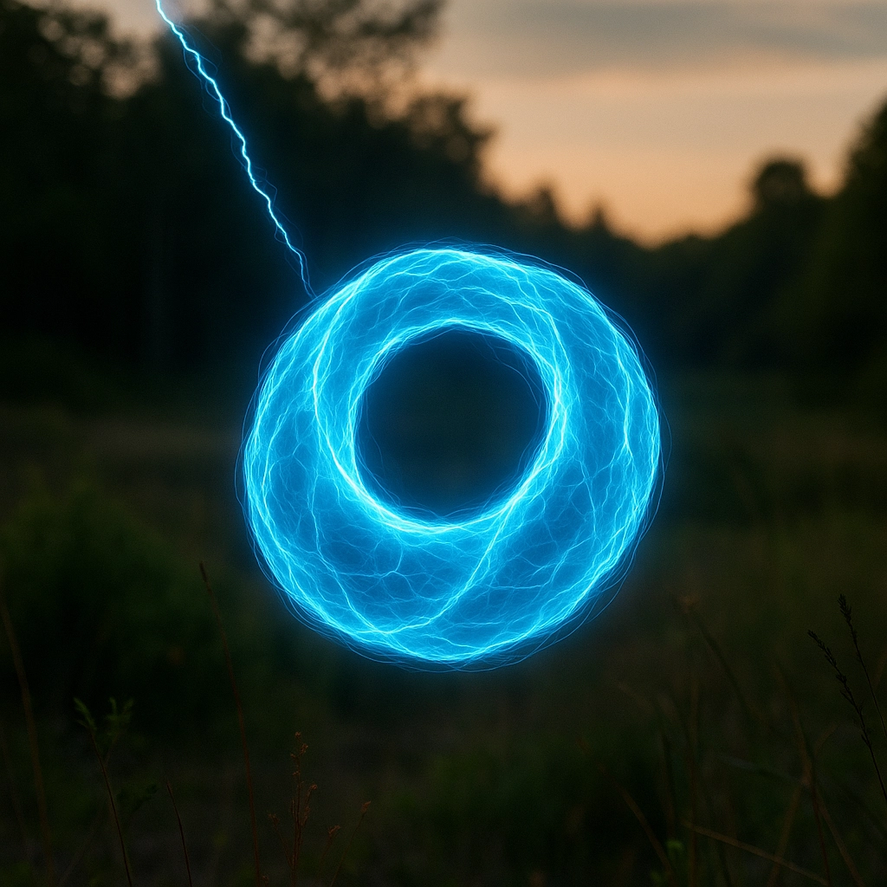

**[繁體中文版](./README-zh-TW.md)**

# Hopfion (Ring) Lightning Hypothesis

**霍普離子環閃電假說**

[](https://doi.org/10.5281/zenodo.17510337)

A theoretical hypothesis proposing that so-called "Ball Lightning" is not a sphere at all, but a **Hopfion (Ring) Lightning** — a topologically protected plasma ring vortex whose energy and stability derive from topological invariants in the electromagnetic field. The observed spherical appearance is an optical artifact of a thick luminous torus.

> This is a living document. Contributions, critiques, and falsification attempts are welcome.



---

## Author

**Kris Lai**
- Email: kriss@scallop.io
- ORCID: [0009-0000-2223-4826](https://orcid.org/0009-0000-2223-4826)
- Affiliation: [Scallop Labs](https://www.scallop.io/)

---

## Documents

| Document | Language | Description |
|----------|----------|-------------|
| [`hypothesis-en.md`](./markdown/en/hypothesis-en.md) | English | Full hypothesis framework in Markdown |
| [`hypothesis-zh-TW.md`](./markdown/zh-TW/hypothesis-zh-TW.md) | 繁體中文 | Full hypothesis framework in Traditional Chinese |

---

## Structure Overview

- **Chapter 0 — Preface** — From lightning to a ring-shaped energy body
- **Chapter 1 — Redefining Ball Lightning** — The misread appearance, bubble ring analogy, core claim
- **Chapter 2 — Hopfion (Ring) Structure** — Topological self-closure, Hopf charge, energy-closure mechanism
- **Chapter 3 — Abstract** — Core hypothesis statement and topological invariant
- **Chapter 4 — Governing Equations** — MHD formulation for Hopfion (Ring) Lightning
- **Chapter 5 — Topological Features** — Self-closed ring loops, Hopf linking, toroidal core
- **Chapter 6 — Formation Mechanisms** — Lightning-triggered and spontaneous topological generation
- **Chapter 7 — Environmental Conditions** — Formation factor weights and thresholds
- **Chapter 8 — Lifetime Extension** — Topologically constrained energy bubble persistence
- **Chapter 9 — Observational Correspondence** — Matching reported phenomena to ring model
- **Chapter 10 — Falsifiable Predictions** — Experimental signatures for verification
- **Chapter 11 — Conclusion** — Scientific positioning as first macroscopic topological soliton

---

## Key Equation

The core topological invariant (Hopf charge):

```
Q_H = ∫ (A · B) d³r ≠ 0
```

When Q_H ≠ 0, magnetic field lines form inseparable knot-and-link configurations, creating a stable electromagnetic "bubble" that can persist in the atmosphere for seconds.

---

## Co-Created With

This hypothesis was co-created with the assistance of AI models and tools:

**AI Models:**
- [Claude Sonnet 4.5](https://anthropic.com/) (Anthropic) — Theoretical Draft
- [GPT-5](https://openai.com/) (OpenAI) — Theoretical Review & Structural Integration
- [Claude Opus 4](https://anthropic.com/) (Anthropic) — Document Migration & Formatting

**Tools:**
- [OpenClaw](https://github.com/openclaw/openclaw) — AI gateway & agent runtime
- [Claude Code](https://claude.ai/claude-code) — Anthropic's agentic coding tool

---

## License

This work is licensed under the [Creative Commons Attribution 4.0 International License (CC BY 4.0)](https://creativecommons.org/licenses/by/4.0/).

You are free to share and adapt this work, provided appropriate credit is given.
